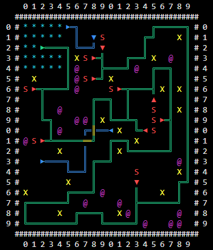

# Random path generator
### Rules of map generation:
- Tower takes 5x5 area on the field
- Each enemy spawner always has only 1 possible path to the tower
- There always must be at least 1 place for weapon and 1 enemy spawner
- Adjacent cells marked as road are merged into one road

<b>Rivers and bridges are decorations</b>

Run in console. C# 7.0

### Output:

